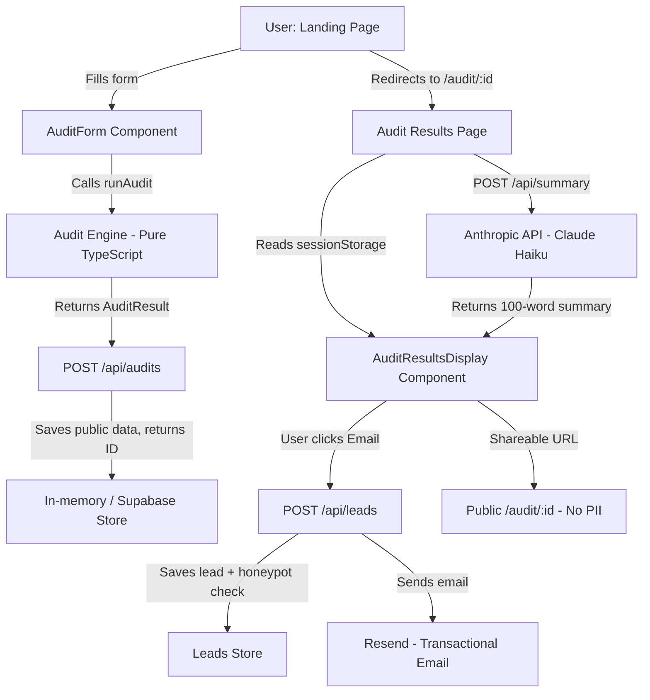

## System Architecture

## Data Flow: Input → Audit Result

1. **User Input** (AuditForm): Tool selections, plan IDs, seat counts, optional actual spend overrides, team size, use case.
2. **Form Validation** (Zod): Schema validates types, min/max values, valid plan IDs.
3. **Audit Engine** (`runAudit`): Pure TypeScript function. No external calls. Applies 8 sets of tool-specific rules. Returns `AuditResult` with per-tool savings, severity, and recommendations.
4. **Audit Storage** (`POST /api/audits`): Strips PII. Stores public snapshot with a nanoid. Returns `id`.
5. **Results Page** (`/audit/:id`): Reads from `sessionStorage` (fresh session) or fetches from API (shareable URL). Fires AI summary in background.
6. **AI Summary** (`POST /api/summary`): Sends structured audit context to Claude Haiku. Falls back to template on failure.
7. **Lead Capture** (`POST /api/leads`): Validates, honeypot checks, rate-limits, stores lead, triggers email.

## Why This Stack

| Decision | Choice | Reason |
|---|---|---|
| Framework | Next.js 14 (App Router) | Server Components + API Routes in one repo. OG metadata per page. Vercel-native deployment. |
| Language | TypeScript | Audit engine needs precise types — `AuditResult`, `Recommendation` — to be testable and readable. |
| Styling | Tailwind + Custom CSS | Tailwind for utilities; custom CSS variables for the design system (white-premium aesthetic). |
| Form | react-hook-form + Zod | Type-safe validation with zero boilerplate. Uncontrolled inputs = fast performance on the form. |
| Database | In-memory → Supabase | Dev uses in-memory Map for zero-setup. Supabase is a one-env-var switch for production. |
| AI | Anthropic Claude Haiku | Cheapest Claude model, fast, sufficient for 100-word summaries. Graceful fallback avoids hard dependency. |
| Email | Resend | Best developer experience for transactional email. Free tier is 3k/mo — more than enough for launch. |
| Abuse protection | Honeypot + Rate limit | Honeypot (invisible field) catches bots without UX friction. IP-based rate limit catches repeat submitters. |

## Scaling to 10k Audits/Day

1. **Replace in-memory Map with Supabase** (PostgreSQL) — already in deps, one env var away.
2. **Add Redis rate limiting** (Upstash) — replaces in-memory `rateLimitMap`.
3. **Cache AI summaries** — key by audit hash. Identical spend profiles get the same summary for free.
4. **Edge function for `/api/audits` and `/api/summary`** — Next.js Edge Runtime at Vercel = ~0 cold starts.
5. **CDN for OG images** — Generate with `@vercel/og`, cache at edge.
6. **Supabase Row-Level Security** — already handles multi-tenant isolation if we add auth later.
